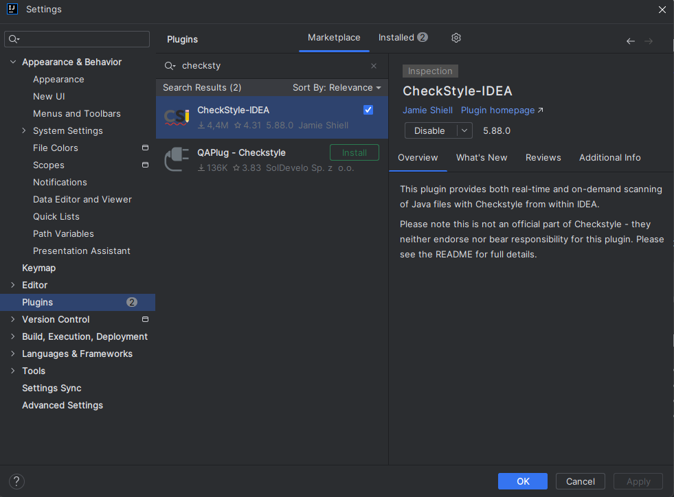
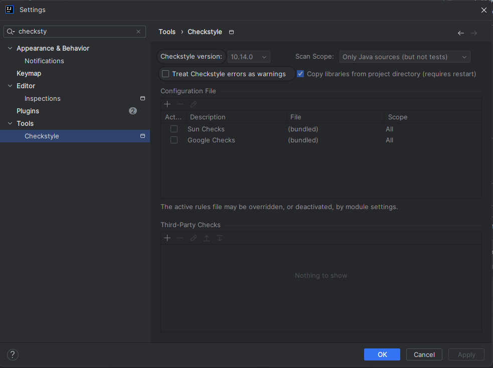
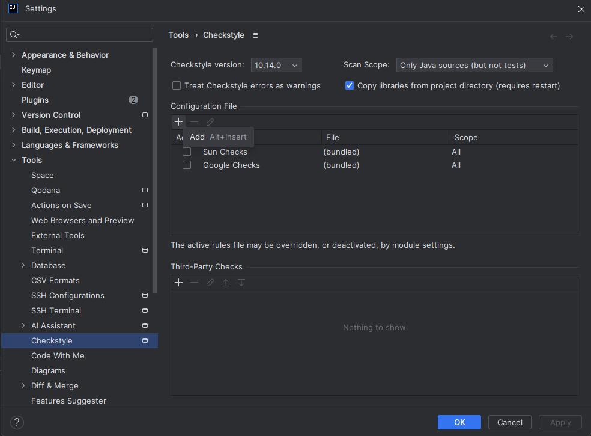
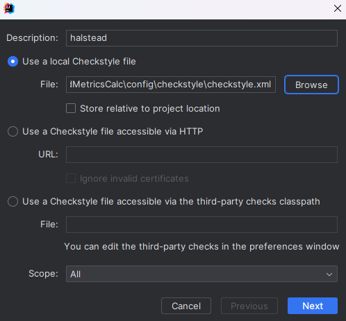
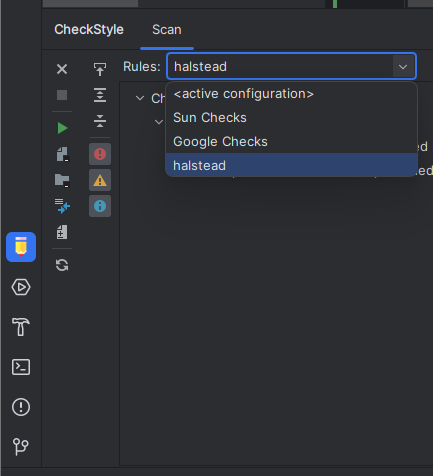
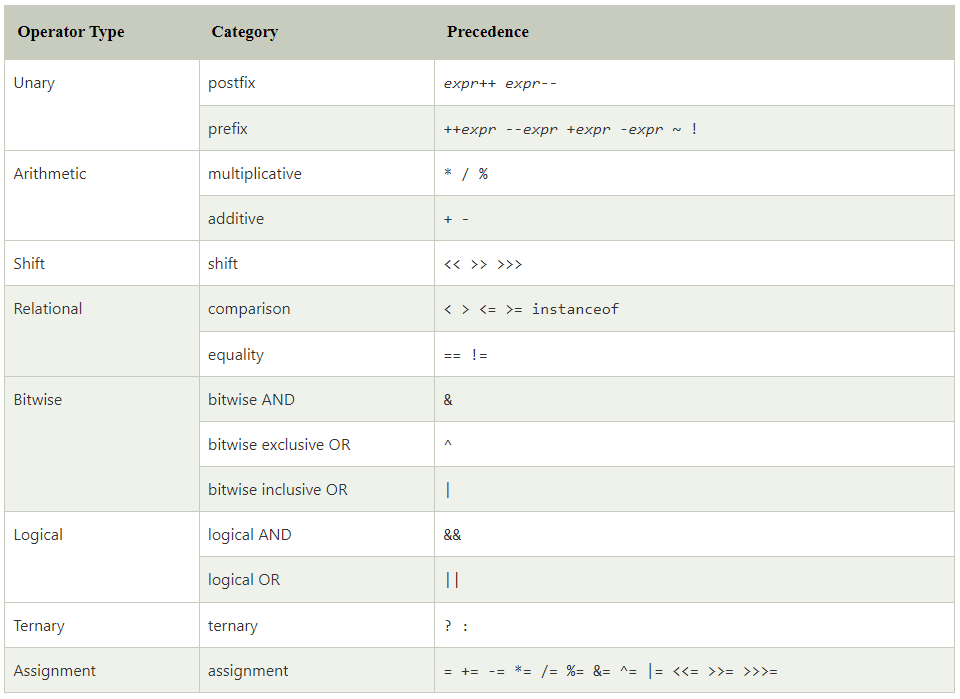

# HalsteadMetricsCalc

## Prerequisites for building
- Java Corretto 17

## How to run it?
1. Make sure your code is fulfilling the checkstyle.xml requirements for this program.
   1. Install the Checkstyle plugin.
   
   
   2. Copy file `./config/checkstyle/checkstyle.xml` from this repository and add this to your repository.
   3. Set this `.xml` file as Checkstyle active configuration. 
      1. Go to File > Settings... > Tools > Checkstyle
      
      
      2. Click `+` icon.
      
      
      3. Select `checkstyle.xml`
      
      
   4. Run checkstyle.
      1. In IntelliJ in left down corner select Checkstyle plugin and select halstead config.
      
      
      2. Press the green tun button.
   5. Correct errors.
2. Run the command with checkstyle valid code.
```
HalsteadMetricsCalc <path to file to be analyzed>
```

## Halstead metrics

- `n1` = the number of distinct operators 
- `n2` = the number of distinct operands 
- `𝑁1` = the total number of operators
- `𝑁2` = the total number of operands


- Program Length: `𝑁 = 𝑁1 + 𝑁2`
  - Represents the sum of total number of operators and operands.


- Program Vocabulary: `n = n1 + n2`
  - Represents the sum of unique operators and operands.


- Program Volume: `V = N ∗ log2(n)`
  - Memory space required for storing the program; so it is represented in bits.


- Difficulty: `D = (n1/2) ∗ (N2/n2)`
  - Difficulty level of the program which is proportional to the number of the unique operator in the program.


- Programming Effort: `E = D ∗ V`
  - Amount of logical and mental exercise required to implement the code from pseudocode.


- Time Required to Program : `T = E/18` 
  - Represented as a reasonable time to produce the program.


- Number of Delivered Bugs: `B =(V/3000)`
  - Number of errors in the implementation. The number of delivered bugs correlates with the overall complexity of the software product. [1]



source: https://www.javatpoint.com/operators-in-java

[1] N. Govil, "Applying Halstead Software Science on Different Programming Languages for Analyzing Software Complexity," 2020 4th International Conference on Trends in Electronics and Informatics (ICOEI)(48184), Tirunelveli, India, 2020, pp. 939-943, doi: 10.1109/ICOEI48184.2020.9142911.
keywords: {Software;Complexity theory;Software metrics;Java;software metrics;Halstead metrics;complexity;estimation},